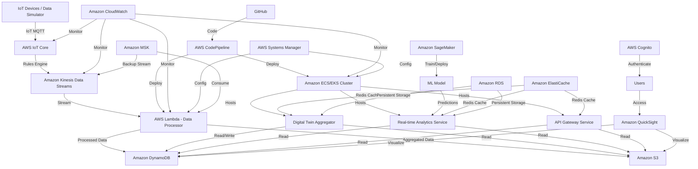

# Battery Digital Twin Project

## Table of Contents
1. [Project Overview](#project-overview)
2. [Architecture](#architecture)
3. [Components](#components)
4. [Setup Instructions](#setup-instructions)
5. [Data Flow](#data-flow)
6. [Machine Learning Model](#machine-learning-model)
7. [Visualizations](#visualizations)
8. [Deployment](#deployment)
9. [Monitoring and Maintenance](#monitoring-and-maintenance)
10. [Future Enhancements](#future-enhancements)
11. [Contributing](#contributing)
12. [License](#license)

## Project Overview

This project implements a digital twin for a Lithium-ion battery system using AWS cloud services. It simulates IoT device data, processes it in real-time, applies machine learning for predictive analytics, and visualizes the results. The system demonstrates proficiency in cloud architecture, real-time data processing, IoT systems, containerization, and machine learning integration.

Key features:
- Real-time IoT data simulation and ingestion
- Scalable data processing pipeline
- Machine learning integration for battery life prediction
- Interactive data visualizations
- Containerized microservices architecture
- CI/CD pipeline for automated deployments

## Architecture

The project uses a serverless, microservices-based architecture on AWS. Here's a high-level diagram of the system:



## Components

| Component | Purpose | Data Sources | Data Sent |
|-----------|---------|--------------|-----------|
| IoT Devices / Data Simulator | Simulate or collect real-time battery data | Battery sensors | Raw battery data (voltage, current, temperature, etc.) via MQTT |
| AWS IoT Core | Manage IoT device connections and data ingestion | IoT Devices | Raw battery data to Kinesis Data Streams |
| Amazon Kinesis Data Streams | Buffer real-time data for processing | AWS IoT Core | Raw battery data to Lambda |
| AWS Lambda - Data Processor | Process and transform raw data | Kinesis Data Streams | Processed data to DynamoDB, aggregated data to S3 |
| Amazon DynamoDB | Store processed, real-time data | Lambda | Processed data to QuickSight, Digital Twin services |
| Amazon S3 | Store raw and aggregated historical data | Lambda | Historical data to QuickSight, Digital Twin services |
| Amazon ECS/EKS Cluster | Host containerized microservices | N/A | N/A (hosts services) |
| Digital Twin Aggregator | Aggregate data from multiple sources | DynamoDB, S3, Redis | Aggregated data to Analytics Service |
| Real-time Analytics Service | Perform real-time analysis on data | DynamoDB, S3, Redis, ML Model | Analysis results to API Gateway Service |
| API Gateway Service | Provide API access to digital twin data | DynamoDB, S3, Redis | API responses to frontend/external services |
| Amazon SageMaker | Train and host ML models | S3 (training data) | ML model predictions to Analytics Service |
| Amazon QuickSight | Create and host data visualizations | DynamoDB, S3 (via Athena) | Visualizations to users |
| AWS Cognito | Manage user authentication | N/A | Authentication tokens to frontend/QuickSight |
| GitHub | Host source code | N/A | Code to AWS CodePipeline |
| AWS CodePipeline | Manage CI/CD pipeline | GitHub | Deployed code/containers to ECS/EKS, Lambda |
| Amazon CloudWatch | Monitor and log system performance | All AWS services | Alerts, logs to administrators |
| AWS Systems Manager | Manage configuration and automation | N/A | Configuration to ECS/EKS, Lambda |
| Amazon ElastiCache (Redis) | Provide high-speed caching | Digital Twin services | Cached data to Digital Twin services |
| Amazon RDS | Provide relational database storage | Digital Twin services | Persistent data to Digital Twin services |
| Amazon MSK | Provide backup data streaming | Kinesis Data Streams | Backup data stream to Lambda |

## Setup Instructions

1. Clone the repository:
   ```
   git clone https://github.com/yourusername/battery-digital-twin.git
   cd battery-digital-twin
   ```

2. Set up AWS CLI and configure with your credentials:
   ```
   aws configure
   ```

3. Deploy the AWS infrastructure using Terraform:
   ```
   cd terraform
   terraform init
   terraform apply
   ```

4. Build and push Docker images for the microservices:
   ```
   cd ../services
   docker-compose build
   docker-compose push
   ```

5. Deploy the ECS/EKS cluster:
   ```
   kubectl apply -f k8s/
   ```

6. Set up the IoT simulator:
   ```
   cd ../iot-simulator
   pip install -r requirements.txt
   python simulator.py
   ```

7. Train and deploy the SageMaker model:
   ```
   cd ../ml
   python train_model.py
   python deploy_model.py
   ```

8. Set up QuickSight dashboards:
   - Log in to the AWS Console
   - Navigate to QuickSight
   - Create a new analysis using the DynamoDB and S3 data sources

9. Set up monitoring and alerts in CloudWatch

## Data Flow

1. IoT simulator generates battery data and sends it to AWS IoT Core via MQTT.
2. IoT Core forwards the data to Kinesis Data Streams.
3. Lambda function processes the data from Kinesis and stores it in DynamoDB and S3.
4. Digital Twin Aggregator service retrieves and aggregates data from DynamoDB and S3.
5. Real-time Analytics service analyzes the aggregated data and makes predictions using the SageMaker model.
6. API Gateway service provides access to the analyzed data and predictions.
7. QuickSight visualizes the data and predictions for end-users.

## Machine Learning Model

The project uses a hybrid model combining physical battery models with machine learning:

1. Physical Model: Based on the equation C = C0e^(fd), where fd is a function of time, temperature, and cycle number.
2. Machine Learning Model: An LSTM neural network trained on historical battery data to predict capacity degradation.

The model is trained and deployed using Amazon SageMaker. For details, see the `ml/` directory.

## Visualizations

QuickSight dashboards provide the following visualizations:

1. Real-time battery voltage, current, and temperature
2. Battery capacity over time and cycle number
3. Predicted vs actual capacity degradation
4. Temperature distribution across battery cycles
5. Anomaly detection in battery performance

## Deployment

The project uses a CI/CD pipeline with GitHub Actions and AWS CodePipeline:

1. Code is pushed to GitHub
2. GitHub Actions run unit tests and static code analysis
3. AWS CodePipeline is triggered on successful GitHub Actions completion
4. CodePipeline builds and deploys updates to ECS/EKS and Lambda

## Monitoring and Maintenance

- CloudWatch is used for monitoring all AWS services
- CloudWatch Alarms are set up for critical metrics (e.g., battery temperature exceeding thresholds)
- CloudWatch Logs collect logs from all services for troubleshooting
- AWS X-Ray provides distributed tracing for the microservices

## Future Enhancements

1. Implement anomaly detection using Amazon SageMaker
2. Add support for multiple battery types
3. Implement a web-based dashboard for real-time monitoring
4. Integrate with a physical battery testing setup for real-world data

## Contributing

Please read [CONTRIBUTING.md](CONTRIBUTING.md) for details on our code of conduct and the process for submitting pull requests.

## License

This project is licensed under the MIT License - see the [LICENSE.md](LICENSE.md) file for details.